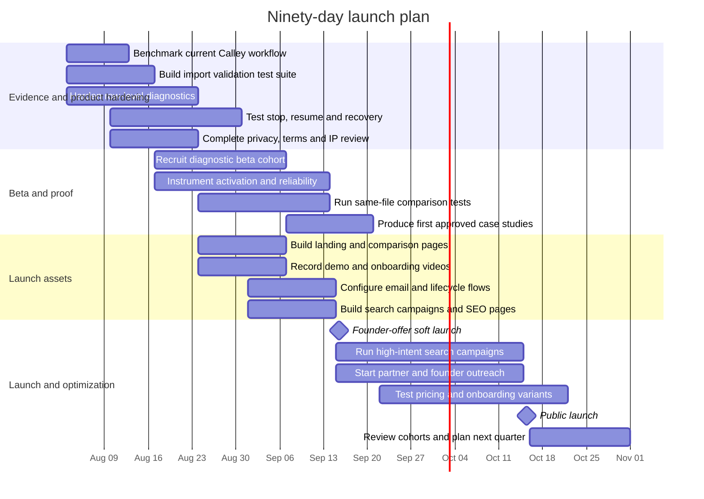

# Calley Complaint Intelligence and Go-to-Market Strategy for a Reliability-First Alternative

## Executive summary

**Research cut-off:** August 3, 2026  
**Product examined:** Calley, published at getcalley.com and distributed through Google Play and Apple’s App Store  
**Clone assumptions supplied for this analysis:** the alternative has substantially the same core mobile-dialing functions, a better interface, improved call-list upload and debugging and a one-time license priced at roughly half of Calley’s published annual price. These are assumptions, not independently verified performance claims.

Calley has a real product footprint and a reasonably broad feature set. Its Android listing reports more than 50,000 downloads, while the product supports SIM-based dialing, call dispositions, multiple calling modes, spreadsheet imports, Google Sheets synchronization, reporting, DNC/DND controls and several CRM or automation integrations. Calley’s current published prices are $29 per month or $290 per year for Pro and $59 per month or $590 per year for Teams. citeturn18view8turn16view9turn21view3

The most useful competitive opening is **not** “the same app for less.” It is:

> **A dependable spreadsheet-to-call workflow that tells users exactly what is wrong before a dialing session begins.**

That position is supported by three overlapping evidence streams:

1. Public reviewers have reported crashes, queue advancement failures, repeated calls, skipped numbers and difficulty stopping a dialing session.
2. Calley’s own help center acknowledges that special characters, spaces, hyphens, plus signs, commas and filenames can cause upload failures or make the dialer loop on one number.
3. Calley’s official onboarding still depends on movement between a web panel and a mobile application, creating more setup and synchronization points than a user may expect from a mobile-first tool. citeturn19search0turn20search1turn18view0turn19search2turn16view5turn16view6

The complaint evidence has important limitations. The strongest negative app-store reviews located are mostly from 2021 and 2022. Calley has continued updating the product, including multiple stability, synchronization, authentication and interface fixes through 2025 and 2026. Apple also says the app’s overall rating was recently reset. It would therefore be misleading to advertise historical complaints as proof that every current Calley user experiences the same problems. citeturn18view0turn18view1turn19search0

The recommended commercial position is:

> **Upload, validate and dial without guessing. An independent Calley alternative with row-level import diagnostics, predictable queue controls and a one-time price.**

Reliability should lead the message. Import clarity should demonstrate the value. One-time pricing should close the sale. “Half-price” should be a substantiated comparison, not the headline. A sustainable founder offer would be approximately **$145 one time for one user** and **$295 one time for five users**, each including 12 months of updates and support. That equals approximately half of Calley’s current published $290 and $590 annual plans. Continued maintenance can be optional after the first year so the perpetual license does not create an unfunded lifetime-support obligation. citeturn16view9

Before making direct superiority claims, run a documented head-to-head benchmark using messy, real-world spreadsheets. Measure accepted rows, time to resolve errors, time to first call, completed queue transitions, stalls and crash-free sessions. The strongest eventual message will be a measured statement such as “validated 98.7% of rows automatically in our test set,” not an unprovable claim such as “never crashes.”

## Research scope and evidence quality

The research prioritized official app-store pages, Calley’s own product and help-center pages and original user reviews. Capterra and G2 were used as secondary review sources. Reddit, X, Product Hunt, Trustpilot, Facebook and niche forums were searched for Calley-specific English-language complaints.

| Source | What was located | Evidence value | Qualification |
|---|---|---:|---|
| Google Play | Official listing, product workflow, download count and negative reviews involving stop controls and queue progression | High | Primary user-generated evidence, though visible negative examples are several years old |
| Apple App Store | Official listing, dated crash and reliability complaints and extensive version history | High | Primary evidence, but Apple reports that the overall rating was recently reset |
| Calley Help Center | Documentation of CSV rejection, formatting sensitivity, repeated-number loops and re-upload requirements | Very high | First-party confirmation that these failure modes are known |
| Calley product and pricing pages | Features, plan limits, workflows, integrations and prices | Very high | Official commercial claims; some page copy appears internally inconsistent |
| Capterra | Complaint about repeated dialing if feedback is not left | Medium | Secondary review platform; the indexed result did not expose the review date |
| G2 | Complaints about desktop/web list loading, lack of mobile upload and list-size limits | Medium | Several reviews are old and some are labeled incentivized |
| Reddit | A relevant dialer discussion containing promotional Calley mentions | Low | No substantial independent Calley complaint thread was located in indexed results |
| X | Mostly official Calley posts | Low | No sufficiently detailed independent complaint post was located in indexed results |
| Product Hunt | Calley references and promotional signals, but no robust indexed review corpus | Low | Product Hunt should not be presented as a complaint source on current evidence |
| Trustpilot | No clearly attributable Calley company review page was located | None | This means “not found in indexed searches,” not that no page or complaint exists |
| Facebook groups | Public indexing was limited and mostly exposed official material | Low | Private-group material should not be scraped or quoted without access and permission |
| Telemarketing and sales forums | General dialer discussions, but no strong Calley-specific complaint corpus | Low | Insufficient evidence for representative quotation |

Indexed Reddit results contained what appeared to be product promotion rather than independent critical discussion. X results similarly skewed toward Calley’s own promotional activity. Facebook search visibility was limited. These channels may still contain complaints inside private groups or unindexed conversations, but such content cannot responsibly be treated as verified public evidence. citeturn8search0turn8search1turn8search2

The evidence base should therefore be described as **directionally strong around import and queue friction, but limited in recency and complaint volume**. Calley is not a product with an overwhelmingly visible public backlash. Your opportunity is to solve a sharp operational problem for a defined subset of users, not to suggest that the incumbent is universally unusable.

## Complaint evidence, functional gaps and UX pain points

The public complaint pattern clusters around five parts of the workflow: data preparation, import validation, web-to-mobile synchronization, progression between calls and session recovery.

| Channel and date | Representative evidence | Reported problem | Commercial implication |
|---|---|---|---|
| Google Play, November 23, 2021 | Reviewer: “There is no way to stop it from dialing.” The reviewer said the phone had to be switched off to end the behavior and also reported skipped numbers. citeturn19search0 | Stop control, queue behavior and user confidence | Make pause, stop and resume controls persistent, immediate and testable |
| Google Play, December 30, 2021 | Reviewer said the app “does not move on to the next call,” undermining its auto-dialing purpose. citeturn20search1turn20search2 | Queue fails to advance | Instrument every queue transition and display the reason when advancement is blocked |
| Apple App Store, September 22, 2022 | “App keeps crashing.” The reviewer also reported login failure after reinstalling and losing a productive dialing day. citeturn18view0turn18view2 | Crash, authentication and recovery failure | Sell session recovery and preserved queue position, not just dialing speed |
| Apple App Store, October 28, 2022 | “Worked great first run through. Then completely stopped.” citeturn18view1 | Intermittent reliability | Offer a visible system-health check and reproducible diagnostic logs |
| Capterra, date not exposed in indexed result | Reviewer reported “getting stuck calling the same number again” when feedback was not left, while also saying support addressed discovered bugs. citeturn19search2turn19search3 | State dependency between feedback and queue progression | Decouple queue continuity from required feedback or clearly show the blocking state |
| G2, principally 2019–2021 reviews | Reviewers criticized needing the desktop/web interface to load lists, the absence of mobile list loading and glitches. Another reviewer cited the 2,000-record per-list limit. citeturn19search1turn7search15 | Context switching, import location and capacity | Make list upload possible wherever the user starts and explain practical limits before upload |
| Calley Help Center, currently published | Calley says CSV uploads may fail because of special characters in filenames or commas and special characters inside fields. Users who cannot resolve the issue are invited to email the file to support. citeturn16view5 | Strict parsing and weak self-service diagnosis | Your clearest differentiator is tolerant parsing plus exact row and column diagnostics |
| Calley Help Center, currently published | Calley says a dialer that loops or fails to proceed may be caused by spaces, hyphens, plus signs or other special characters in phone numbers. The recommended remedy is to clean and re-upload the list. citeturn16view6 | Import defects emerge during dialing rather than before it | Validate and normalize every phone field before the first call is enabled |
| Apple version history, 2024–2026 | Release notes mention synchronization improvements, authentication validation, schedule-call fixes, special-character password fixes, UI work, stability enhancements and an iOS 18.5 issue where calls did not initialize. citeturn18view1turn18view3 | Continuing reliability and UX maintenance | Historical complaints are plausible but must be presented alongside evidence of ongoing remediation |

Calley’s official workflow explains why import defects can create disproportionate frustration. Numbers are loaded through a web panel, synchronized to the mobile app and then processed sequentially as users save post-call dispositions. A malformed number can therefore travel through the upload and synchronization stages before blocking progression in the dialing stage. citeturn16view0turn16view6

Official Calley images illustrate the current separation among importing, mapping or distributing data and selecting a mobile calling mode:

iturn12image0turn12image2turn12image3turn12image4

The documented weaknesses do not mean Calley lacks functionality. The product supports XLS, XLSX and CSV standard imports, Power Import for files containing up to 100,000 leads and Google Sheets synchronization. However, practical active-list sizes are 50 records for Personal, 2,000 for Pro and 10,000 for Teams. The distinction between “upload up to 100,000” and “active records in one list” can be difficult for buyers to understand without reading the documentation carefully. citeturn21view0turn21view2turn16view9

The central UX gaps to target are therefore more precise than “bad usability”:

| Pain area | Current evidence | Better product behavior |
|---|---|---|
| File rejection | Special characters in names and delimiters inside fields can cause rejection | Accept common variations, escape valid CSV content and show a preview before committing |
| Phone normalization | Spaces, hyphens and plus signs can disrupt queue progression | Normalize to a canonical format while preserving the original value |
| Error specificity | Documentation gives category-level causes, then directs unresolved users to support | Identify the exact row, column, value, rule and suggested correction |
| Error timing | A malformed number can reveal itself when the dialer loops or stalls | Block or quarantine invalid rows before dialing begins |
| Recovery | Reviews report crashes, failed continuation and reinstall/login difficulty | Persist queue state locally and server-side, then offer one-tap session recovery |
| Stop behavior | A reviewer reported difficulty stopping automated progression | Provide an always-visible hard stop with confirmation of queue state |
| Feedback dependency | A reviewer reported repeated dialing when feedback was omitted | Allow skip, defer or configurable default feedback without looping |
| Device switching | Pro officially permits one active Android or iPhone device | Explain device entitlement clearly and offer safe device transfer if supported |
| Web/mobile context | List management occurs in the web panel while calls are triggered through mobile | Offer mobile upload or a seamless deep-linked handoff with progress indicators |
| Import observability | Calley offers support-assisted file troubleshooting | Give the user a downloadable diagnostic report before asking for support |
| iOS parity | Some calling behavior and OS restrictions can differ by platform | Publish a transparent Android-versus-iOS capability matrix |
| Recording | Calley’s Android recording can depend on Calley Rec or third-party recorders and Google Drive synchronization | Avoid promising native recording unless technically and legally supported |

Calley’s breadth should not be underestimated. Pro includes preview, power, uninterrupted, app-based and WhatsApp-oriented modes, DNC/DND management, scheduled calls, custom dispositions, reports and third-party dialing through applications such as Google Voice, Skype, Zoiper and TextNow. It also advertises API, webhook, Zapier, Pabbly, Make, HubSpot, Salesforce, Zoho and Google Calendar integrations. citeturn21view3turn21view5turn21view6

This matters for positioning: **your strongest initial market is not the buyer seeking the widest integration catalog.** It is the buyer whose core job is importing a spreadsheet and reliably completing a mobile call list.

## Calley versus the proposed alternative

The comparison below distinguishes verified Calley capabilities from assumptions about the cloned application. Anything marked “assumed” must be tested before appearing in advertising.

| Dimension | Calley | Proposed independent alternative | Proof required before launch |
|---|---|---|---|
| Core dialing | SIM-based mobile auto-dialing with power, preview, uninterrupted, app and WhatsApp-related modes | Same core functions, assumed | Feature-by-feature test on supported Android and iOS versions |
| Call progression | Post-call dispositions trigger progression; public reports include stalled, skipped and repeated calls | Deterministic progression with skip, pause, stop and resume, assumed | At least 10,000 automated transition tests plus real-device beta data |
| Import formats | XLS, XLSX, CSV, Google Sheets sync and Power Import | Same common formats plus a more tolerant parser, assumed | Published format matrix and messy-file test suite |
| Import capacity | Personal 50 records, Pro 2,000 per list, Teams 10,000 per list; Power Import can receive up to 100,000 records | Capacity unspecified | Stress tests, processing-time limits and transparent plan limits |
| Upload validation | Known sensitivity to filename characters, commas in fields and formatted phone numbers | Row-level errors, normalization and suggested repairs, assumed | Screenshots and downloadable sample diagnostic report |
| Debugging | Documentation and support-assisted troubleshooting; users may need to clean and re-upload files | Exact row, column, reason and repair preview, assumed | Demonstration using a reproducible broken file |
| Upload location | Official workflow centers on loading data through the web panel and syncing it to mobile | Web and mobile upload, recommended assumption | Confirm mobile file-picker, cloud storage and Google Sheets flows |
| Reliability | Older public crash, loop and advancement complaints; frequent recent fixes and stability releases | Improved reliability, claimed but not verified | Crash-free rate, queue-stall rate, status page and benchmark methodology |
| Session recovery | Current implementation details are not clearly documented publicly | Preserve list position after crash, logout or interruption, recommended | Kill-app, reboot, offline and account-refresh recovery tests |
| Reporting | Mobile and web reports, call dispositions, graphs and team reporting | Same core reporting, assumed | Side-by-side report inventory |
| Integrations | Relatively extensive CRM and automation support | Unspecified | Do not claim parity until each connector is shipping |
| DNC/DND controls | Official DNC/DND list management | Same core protection, assumed | Suppression test and audit log |
| Call recording | Android recording through Calley Rec or third-party tools with Google Drive sync | Unspecified | Legal and platform review before advertising |
| Device entitlement | Pro supports one logged-in Android or iPhone; Teams supports multiple agents | Unspecified | Clear license-transfer and seat policy |
| Onboarding | Web sign-up, file upload, mapping, mobile sign-in, synchronization, mode selection and dialing | Guided import health check, corrected preview and three-call setup exercise | Time-to-first-call usability study |
| Support | Email, phone and file-assisted upload support; customer reviews include positive support comments | In-app diagnostics, onboarding help and a defined SLA, recommended | Staffing plan, hours and maximum response time |
| Free access | Personal offers 25 calls per day, one list and 50 records; paid plans advertise seven-day trials | Recommended 14-day or 100-call diagnostic trial | Abuse protection and conversion economics |
| Published price | Pro $29 monthly or $290 yearly; Teams $59 monthly or $590 yearly | Recommended $145 Solo and $295 Team one time | Pricing page, tax handling and refund policy |
| Update economics | Recurring subscription helps fund continuing development | Perpetual core license with 12 months of updates and support, then optional maintenance | Financial model for support cost and platform maintenance |

Calley’s English-language feature page contains at least one apparent inconsistency: one area describes a Pro list size of 2,000 while another says each list allows 500 numbers at once. The formal feature-comparison and pricing tables consistently state 2,000 records for Pro, so 2,000 is the safer comparator. Your own pricing and capacity pages should use one vocabulary and one clearly defined limit. citeturn21view0turn21view3turn21view6

**Recommended category language**

Do not market the product publicly as a “Calley clone.” Use:

> **An independently developed mobile auto-dialer and Calley alternative.**

“Clone” increases unnecessary concerns about copied code, copied interfaces, trademark confusion and vendor legitimacy. The U.S. Copyright Office confirms that original source and object code can be copyright-protected, while the USPTO warns that similar marks and related services can create confusion about commercial source. Use independently written code, original visual assets, original copy and a distinctive name. Have counsel review code provenance and interface similarity before launch. citeturn16view13turn16view14

**Recommended pricing architecture**

| Offer | Recommended price | Included | Position |
|---|---:|---|---|
| Founder Solo | **$145 one time** | One user, perpetual use of purchased core version, 12 months of updates and standard support | Approximately half of Calley Pro’s current $290 annual price |
| Founder Team | **$295 one time** | Up to five calling users, 12 months of updates and priority onboarding | Approximately half of Calley Teams’ current $590 annual price |
| Optional Solo Care | **$49 yearly after year one** | Continued feature updates and priority support | Optional, not required to keep using the licensed version |
| Optional Team Care | **$99 yearly after year one** | Continued updates, priority support and team onboarding | Protects long-term support economics |
| Diagnostic trial | **Free for 14 days or 100 calls** | Full list preflight, limited dialing and sample reports | Lets the differentiated feature prove itself |

The safest public presentation is **“Founder license from $145 one time.”** A comparison footnote can say that $145 is 50% of Calley Pro’s published $290 annual price as observed on August 3, 2026. Pricing comparisons and sale claims must be truthful and use a genuine comparison basis. citeturn16view9turn16view12

Do not use a crossed-out fictional price such as “Normally $290, today $145” unless your own product has genuinely been offered at $290 for a meaningful period. Calley’s price is a competitor comparison, not your former price.

## Target segments, positioning and acquisition channels

The ideal early customer is not a large contact center with a procurement team and complex telephony infrastructure. It is a person or small team that already has leads in a spreadsheet, makes outbound calls from mobile numbers and loses time when a file does not import or the calling queue does not behave predictably.

| Segment | Triggering problem | Buying message | Best initial channels |
|---|---|---|---|
| Solo real estate agents | Portal, event and open-house leads arrive as CSV or spreadsheets | “Turn today’s lead spreadsheet into a clean calling queue in minutes.” | Google Search, YouTube, real-estate coaches and broker communities |
| Mortgage brokers | Time-sensitive leads, multiple number formats and follow-up requirements | “Validate every phone row before the first call.” | LinkedIn, mortgage communities, search and industry newsletters |
| Insurance producers | High-volume prospect lists and strong sensitivity to subscription costs | “Pay once for a dialer that shows you exactly which records need attention.” | Producer groups, agency trainers, YouTube and affiliate partnerships |
| Recruiters and staffing firms | Candidate lists arrive from multiple exports with inconsistent formatting | “Clean candidate call lists automatically, then resume exactly where you stopped.” | LinkedIn outbound, recruiting communities and agency partnerships |
| Lead-generation and marketing agencies | Files come from multiple clients and sources | “Diagnose client files before they become agent downtime.” | Agency communities, cold email, search and template-led content |
| Small B2B sales teams | No dedicated sales operations or IT administrator | “A spreadsheet-to-call workflow your reps can troubleshoot themselves.” | LinkedIn, sales communities and comparison-search pages |
| Event follow-up teams | Large lead batches must be contacted shortly after an event | “Import, validate and call while the leads are still warm.” | Event marketers, agencies and post-event workflow content |
| Local service businesses | Owners call quote requests from a phone and dislike recurring SaaS | “Simple mobile follow-up without another monthly bill.” | Local-business YouTube, search and reseller partnerships |

Calley itself targets startups, sales teams, HR firms, event businesses, real estate, insurance and mortgage users, so these segments are already educated about the category. citeturn19search1turn14search5

**Recommended positioning hierarchy**

| Priority | Message | Why it should appear here |
|---|---|---|
| Primary | **Know what is wrong with your list before you start calling** | Directly addresses the most defensible gap |
| Secondary | **Pause, resume and recover without losing your place** | Converts reliability into a concrete workflow benefit |
| Supporting | **Upload from a clearer, guided workflow** | Reduces perceived implementation risk |
| Price closer | **Pay once instead of adding another monthly subscription** | Strong differentiator after the value is understood |
| Trust proof | **See benchmark results, system status and real import reports** | Makes comparative claims credible |

**Messaging angles to use**

| Angle | Strong formulation | Avoid |
|---|---|---|
| Import clarity | “See the exact row and value that needs attention.” | “Calley cannot import CSVs.” |
| Normalization | “Automatically standardize common phone-number formats before dialing.” | “Every spreadsheet works perfectly.” |
| Queue reliability | “Preserve your place and explain why a row cannot advance.” | “Never stalls.” |
| Usability | “From upload to first call with fewer handoffs.” | “Calley is impossible to use.” |
| Price | “Founder license from $145 one time.” | “Lifetime support forever.” |
| Comparison | “An independent alternative for spreadsheet-first mobile callers.” | “Official Calley replacement” or wording implying affiliation |
| Evidence | “In our published test, X of Y messy rows were corrected automatically.” | Unsupported “more reliable” claims |

**Channel priorities**

| Tier | Channel | Execution |
|---|---|---|
| Highest | High-intent Google Search | Target “Calley alternative,” “mobile auto dialer CSV,” “call list upload error,” “spreadsheet auto dialer” and problem-oriented terms |
| Highest | YouTube search content | Publish short demonstrations fixing malformed files, plus a full “spreadsheet to first call” walkthrough |
| Highest | Direct founder outreach | Contact public business users who have explicitly discussed the relevant problem, using a diagnostic offer rather than an immediate sales pitch |
| High | LinkedIn | Target solo producers, recruiting agency owners and small sales managers with spreadsheet-based workflows |
| High | Comparison and problem SEO | Build a factual Calley comparison page plus technical pages explaining CSV, XLSX and phone normalization |
| Medium | Partnerships | Recruit real-estate, insurance and recruiting coaches who can demonstrate the workflow to an existing audience |
| Medium | Reddit and specialist communities | Provide useful troubleshooting content and disclose affiliation. Do not astroturf or post unsolicited promotions |
| Medium | Product Hunt | Use for launch-day credibility and feedback, not as the primary customer-acquisition engine |
| Later | App-store optimization | Pursue once crash telemetry, onboarding and review-generation processes are stable |
| Later | Paid social | Retarget high-intent visitors and video viewers rather than starting with broad cold audiences |

The highest-converting lead magnet is likely not an ebook. It is a **free list health check**. Let visitors upload a redacted or synthetic spreadsheet and receive:

- valid-row count
- automatically repairable-row count
- blocked-row count
- duplicate count
- normalized phone preview
- downloadable error report
- estimated time saved

This gives users value before requiring them to believe a broad reliability claim.

## Go-to-market assets and sales playbook

**Landing-page structure**

| Element | Recommended copy |
|---|---|
| Eyebrow | **The mobile auto-dialer built for messy spreadsheets** |
| Headline | **Upload your call list. See every issue before you dial.** |
| Subheadline | **Validate phone numbers, repair common formatting problems and start a predictable mobile calling queue, with simple one-time pricing.** |
| Primary CTA | **Test my list free** |
| Secondary CTA | **Watch a three-minute demo** |
| Proof strip | **Row-level diagnostics · Queue recovery · CSV/XLSX support · One-time founder license** |
| Comparison qualifier | **Independent product. Not affiliated with or endorsed by Calley.** |

**Landing-page benefit bullets**

- **Fix the row, not the whole file:** See the exact cell causing an import problem.
- **Normalize before calling:** Preview corrections for spaces, hyphens, country codes and other common number formats.
- **Protect your queue position:** Pause, stop or recover a session without starting the list again.
- **Know what will be skipped:** Quarantine invalid records and download a clean error report.
- **Move from list to call faster:** Use guided mapping, a sample file and a three-call setup test.
- **Pay once:** Founder licensing starts at $145 rather than another recurring subscription.

These statements should only go live after the corresponding functions have passed acceptance testing.

**Recommended ad headlines**

| Search and social headlines | Supporting description |
|---|---|
| Calley Alternative With Clear Import Errors | See which rows need fixing before your calling session starts. |
| Stop Debugging CSVs. Start Calling. | Validate, normalize and preview your list in one guided workflow. |
| Upload. Validate. Dial. | A spreadsheet-first mobile auto-dialer with one-time pricing. |
| Your Call List Should Not Break Your Dialer | Find malformed numbers before they stall your queue. |
| Mobile Auto-Dialer, One-Time Price | Founder licenses from $145 with 12 months of updates. |
| Pay Once. Keep Calling. | Core mobile dialing without another monthly software bill. |
| See Every Bad Row Before You Dial | Download a clear report with suggested corrections. |
| A More Diagnosable Mobile Dialer | Know why a record is blocked and how to fix it. |
| Import Messy Lead Lists With Confidence | Preview phone normalization before accepting changes. |
| Resume From the Exact Call You Stopped At | Preserve queue position through interruptions. |
| Built for Spreadsheet-Based Sales Teams | CSV and XLSX lists without blind trial and error. |
| Test Your Call List Free | Get a list-health report before choosing a plan. |

Use “Calley alternative” as a nominative comparison in search copy only after legal review. Do not incorporate “Calley” into your own product name, domain, icon or app-store identity.

**Email sequence**

| Timing | Subject | Core email |
|---|---|---|
| Immediately after diagnostic | **Your call-list health report is ready** | “Your file contained [X] valid rows, [Y] rows we can repair automatically and [Z] blocked rows. The attached report identifies each issue. Approve the suggested fixes to run a three-call test.” |
| Day two | **The errors your spreadsheet did not show you** | Explain one or two concrete problems found, such as mixed country codes or hidden characters. Show the corrected preview rather than making a generic sales pitch. |
| Day four | **What happens when a calling session is interrupted?** | Demonstrate stop, resume and preserved queue position. Include a short benchmark or screen recording. |
| Day seven | **Founder access: pay once instead of monthly** | Present $145 Solo and $295 Team pricing, 12 months of support and the optional future maintenance model. |
| Day ten | **Your diagnostic expires tomorrow** | Give a genuine expiration for uploaded-file retention or a genuine founder-offer deadline. Restate deletion and privacy controls. |
| Day fourteen | **Should I close your file?** | “Unless you ask us to retain it, we will delete the uploaded file and diagnostic data on [date]. Here is the report-download link before deletion.” |

Commercial email is subject to CAN-SPAM even when sent business to business. Headers and subject lines must be accurate, the sender must include a valid postal address and recipients must have a functioning opt-out mechanism. citeturn16view11

**Trial and onboarding flow**

| Stage | User experience | Instrumentation |
|---|---|---|
| Account creation | Email or trusted sign-in, followed by a one-question role selector | Sign-up completion and abandoned step |
| Data choice | Upload a sample, use a template or provide a real redacted file | Source type and upload-start rate |
| Preflight | Scan headers, delimiters, encoding, number formats, duplicates and empty rows | Processing time, warning categories and failure rate |
| Diagnostic result | Separate valid, auto-fixable and blocked records | Percentage in each class |
| Correction preview | Show old value, proposed value and reason | Approval and rejection rates by fix type |
| Mapping | Suggest likely name, number, company and notes columns | Mapping correction frequency |
| Privacy choice | Set retention period and request deletion at any point | Selected retention and deletion fulfillment |
| Three-call test | Dial three safe test contacts or user-controlled numbers | Time to first call and transition success |
| Workflow setup | Configure dispositions, reminders, DNC behavior and messaging templates | Setup completion |
| First real session | Recommend an initial batch of 25 calls | Queue completion and stall rate |
| Post-session result | Show calls, outcomes, interruptions and time saved | Activation and purchase intent |
| Purchase | Choose Solo or Team founder license | Trial-to-paid conversion and refund rate |

Do not request that prospects upload live customer data before privacy controls, encryption, retention rules and deletion mechanisms are operational. A redacted sample or synthetic template should always be available.

**Objection-handling scripts**

| Objection | Response |
|---|---|
| “I already use Calley.” | “You do not need to migrate first. Upload the same redacted list into both products and compare accepted rows, setup time and completed queue transitions. Keep whichever workflow performs better for you.” |
| “How do I know yours is more reliable?” | “Do not take the claim on faith. The trial shows the import report, and we publish crash-free sessions, queue-stall rates and the method behind our benchmark.” |
| “One-time software usually gets abandoned.” | “The founder license keeps the purchased core version usable. It includes 12 months of updates and support. Continuing feature updates are funded through optional maintenance rather than an undefined lifetime promise.” |
| “Calley has more integrations.” | “Calley has a broad integration catalog. This product is initially optimized for users who work from CSV, XLSX and mobile call lists. Here is the current integration matrix so you can see exactly what is supported.” |
| “Will my existing list import?” | “Run it through the free preflight. You will see valid, repairable and blocked records before committing to a purchase.” |
| “I use more than one phone.” | “Here is the device and seat policy in writing. We do not hide device-transfer rules inside checkout.” |
| “Can it really handle large lists?” | “Here are the tested list sizes, processing times and active-queue limits. We will not describe an upload maximum as an active-list maximum.” |
| “What happens when the application closes?” | “The queue is checkpointed after each transition. Reopen the session and review the saved position before resuming.” This answer should be used only after that behavior is verified. |
| “Is this affiliated with Calley?” | “No. It is an independently developed alternative and is not affiliated with, endorsed by or sponsored by Calley.” |
| “Why is it so inexpensive?” | “The founder offer is designed to fund an early customer cohort and establish benchmark data. The scope, included support period and optional maintenance are stated up front.” |

**Competitive claim framework**

Use three levels of claims:

| Claim type | Example | Launch condition |
|---|---|---|
| Verifiable feature claim | “Shows row-level import errors.” | Feature exists and can be demonstrated |
| Measured performance claim | “Automatically normalized 97% of repairable rows in our 10,000-row test set.” | Methodology and test data are documented |
| User-experience claim | “Users in our beta reached their first call in a median of seven minutes.” | Sufficient sample size and disclosed cohort |

Avoid absolute claims such as “bug-free,” “never loses a call,” “imports everything” or “always works.” Comparative advertising should be truthful, narrowly worded and supported by evidence that reflects current versions of both products.

## Social proof, complaint outreach and legal guardrails

The best social proof should demonstrate the exact differentiated workflow rather than collecting vague five-star statements.

| Strategy | Execution | Publishable proof |
|---|---|---|
| Import Rescue beta | Invite users with troublesome spreadsheets to submit a redacted sample | Before-and-after row counts and screenshots of the diagnostic report |
| Same-file comparison | With consent, process the same synthetic or redacted file in both tools | Accepted records, resolution time and time to first call |
| Queue endurance test | Run a controlled multi-hour session across supported devices | Completed transitions, stalls, interruptions and recoveries |
| Verified case study | Record a customer importing and dialing a real but anonymized workflow | Role, list size, setup time and measurable outcome |
| Public reliability page | Publish rolling crash-free session and queue-stall metrics | Weekly or monthly operational data |
| Public changelog | Document fixes, regressions and known limitations | Evidence of active maintenance and honesty |
| Diagnostic gallery | Publish common import defects using synthetic examples | Educational proof without exposing prospect data |
| Review request after value event | Ask for an honest review after a completed call list or resolved import | Review tied to a genuine product experience |
| Customer advisory group | Give early users roadmap input without requiring positive comments | Named advisers only with explicit consent |
| Support-resolution proof | Measure the percentage of import tickets resolved by self-service diagnostics | Reduction in support dependence |

The FTC’s Consumer Reviews and Testimonials Rule took effect on October 21, 2024 and addresses fake, false and otherwise deceptive reviews. Do not create fictional testimonials, impersonate customers, buy undisclosed endorsements or condition an incentive on a positive rating. citeturn16view10

Any incentive for participating in a case study or providing a review should be disclosed. The customer must remain free to be positive, neutral or negative. Permission to use someone’s review should be separate from permission to use their name, company, screenshot or data.

**Public reply to a complaint**

> Sorry you are dealing with a stalled calling queue. I am building an independent mobile auto-dialer focused on list validation and row-level diagnostics. I can run a redacted sample through the checker at no charge and send you the error report. Please do not post customer data publicly. I am not affiliated with Calley.

This approach acknowledges the stated issue without asserting that Calley caused it. It also offers diagnostic value before asking for a sale.

**Private message or email**

**Subject:** A quick way to diagnose your call-list issue

> Hi [Name],  
>   
> I saw your public post about [specific issue in their own words]. I am building [Product], an independent mobile auto-dialer with preflight validation and row-level error reporting.  
>   
> I can test a redacted sample and send you a report showing invalid rows, formatting conflicts, duplicates and suggested corrections. There is no obligation to buy. I will not publish your post, file or results without separate written permission.  
>   
> Please remove personal or confidential information before sending a sample. If this is not useful, reply “no” and I will not follow up.  
>   
> [Name]  
> [Company and postal address]  
> [Unsubscribe instruction]

**Single follow-up**

**Subject:** Closing the loop on your call-list issue

> Hi [Name],  
>   
> I am closing the loop on my earlier note. The offer to test a redacted list is still open. The checker reports invalid rows, duplicates, number-format conflicts and suggested fixes before dialing starts.  
>   
> I will not contact you again after this message.  
>   
> [Signature and unsubscribe instruction]

**Recruiting beta testers from a community**

> I am testing an independently developed mobile auto-dialer for salespeople whose CSV or XLSX files contain inconsistent phone formats. The beta shows row-level errors and proposed corrections before any call begins.  
>   
> I am looking for [number] testers who can use redacted or synthetic data. Participants receive founder access in exchange for candid feedback, not a positive review. I am the product’s developer and this post is promotional.

**Case-study permission request**

> May we publish an anonymized case study containing the list size, categories of import errors, time to first call and final completion rate? We will not use your name, company, screenshot, testimonial or underlying records unless each item is approved separately in writing. Participation is optional and does not affect your account or support.

**Privacy and conduct rules**

Do not scrape private Facebook groups, app-store identities or personal profiles to discover private contact information. Contact someone only through a channel they have made available for relevant business communication or through a platform-native reply or message that complies with platform rules. Do not quote a private group post in an advertisement. Do not upload someone’s complaint, username or profile image to your landing page without permission.

Do not imply that every person who complained about Calley needs your product. Mention the exact public issue, offer a test and stop after one follow-up. Maintain a suppression list so opt-outs apply across campaigns.

Your comparison page should include the research date, plan being compared and a statement that product features and pricing can change. Do not use Calley’s logo, screenshots or app-store artwork as decorative marketing assets without determining that the use is legally permitted. A text comparison is safer than reproducing branded creative.

The name, icon and interface should create a distinct commercial impression. Similar names or branding for related software may create a likelihood of source confusion under trademark principles. Independently written code is also essential because computer code may be copyright-protected. citeturn16view13turn16view14

A practical disclaimer for the comparison page is:

> Calley is a trademark of its respective owner. [Product] is an independently developed product and is not affiliated with, endorsed by or sponsored by Calley. Feature and price comparisons were researched on August 3, 2026 and may change. Tests reflect the files, devices and versions described in the methodology.

## Metrics and ninety-day launch timeline

The initial measurement system should prove three propositions: users can get clean data into the product, the queue behaves predictably and the one-time offer produces enough revenue to support customers.

| Funnel area | Metric | Why it matters | Initial 90-day target |
|---|---|---|---:|
| Acquisition | Qualified landing-page visits | Separates relevant traffic from broad clicks | Establish baseline by channel |
| Acquisition | Cost per diagnostic start | Measures the cost of generating a real product interaction | Below 20% of Solo license revenue |
| Intent | Visitor-to-upload-start rate | Tests whether the diagnostic offer is compelling | 15–25% on high-intent traffic |
| Import | Upload completion rate | Exposes file-picker, size and parser friction | At least 70% |
| Import | Valid or auto-fixable row rate | Demonstrates the value of normalization | At least 90% across beta files |
| Import | Unexplained rejection rate | Detects generic errors that contradict the positioning | Below 1% of uploads |
| Import | Median diagnostic-processing time | Affects perceived responsiveness | Under 30 seconds for stated standard size |
| Activation | Median time to first valid list | Direct usability measure | Under five minutes |
| Activation | Median time to first call | Primary onboarding outcome | Under ten minutes |
| Activation | Three-call test completion | Shows that users cross from import to actual calling | At least 60% of completed uploads |
| Reliability | Crash-free sessions | Core credibility metric | At least 99.5%, after sample-size qualification |
| Reliability | Queue stalls per 1,000 transitions | Measures the exact complained-about failure mode | Fewer than one |
| Reliability | Recovery success rate | Tests whether interrupted sessions resume correctly | At least 99% in controlled tests |
| Reliability | Sync latency at median and 95th percentile | Detects web/mobile handoff problems | Publish after baseline |
| Conversion | Trial-to-paid rate | Tests pricing and demonstrated value | 12–20% |
| Revenue | Revenue per activated trial | Better than raw conversion for mixed Solo and Team plans | Establish baseline |
| Revenue | Refund rate | Flags unqualified demand or expectation gaps | Below 5% |
| Economics | Support minutes per paid account | Critical for one-time pricing | Under 45 minutes during first 30 days |
| Economics | Gross contribution after support | Confirms founder pricing is sustainable | Positive by cohort |
| Retention | Active calling days at 30, 60 and 90 days | Shows continued utility despite one-time payment | Establish cohort curve |
| Retention | Calls per active account | Indicates depth of adoption | Segment by role |
| Satisfaction | Post-import CSAT | Measures the differentiated workflow | At least 4.5/5 |
| Satisfaction | Post-session CSAT | Separates import quality from dialing quality | At least 4.3/5 |
| Advocacy | Referral and honest-review rate | Measures genuine product enthusiasm | 10% combined by day 90 |
| Compliance | DNC suppression failures | Safety-critical guardrail | Zero confirmed failures |
| Privacy | File-deletion SLA achievement | Verifies privacy promises | 100% within stated period |
| Outreach | Unsubscribe and complaint rate | Detects aggressive or poorly targeted messaging | Monitor by source and stop deteriorating campaigns |

Targets such as a 99.5% crash-free rate should be labeled as internal goals until enough production sessions exist for the number to be statistically meaningful. Publish the denominator, covered platforms, date range and version alongside any reliability percentage.

The launch gate should not be a calendar date alone. Before the September soft launch, require a functioning import diagnostic, tested session recovery, privacy controls, a documented device matrix and reliable telemetry. Before the October public launch, require at least one approved case study, a published benchmark methodology and enough sessions to support any reliability language used in ads.

The strategic conclusion is straightforward: **do not sell a cheaper copy of Calley. Sell relief from uncertainty between spreadsheet upload and completed call queue.** Calley’s documented feature breadth makes a generic parity claim difficult to win. Its own troubleshooting documentation and the recurring themes in public complaints create a narrower, more credible opening around import diagnostics, state recovery and understandable queue behavior. Price the one-time license as a strong closing advantage, then build the campaign around observable proof that users can upload, understand and complete their lists with less intervention.